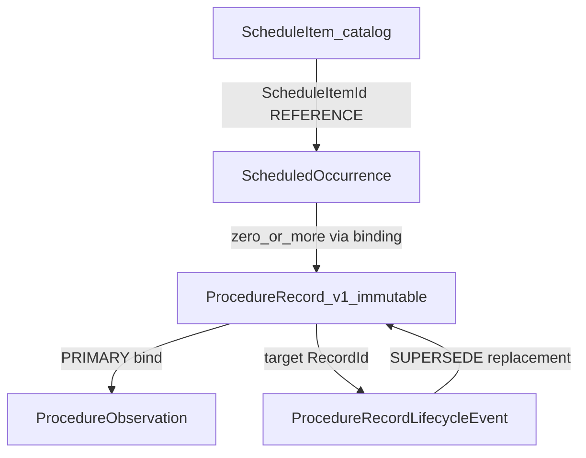

# KIOSK-SPFX-SCHEMA-CONTRACT-DESIGN-1

```text
repository: yasutakesougo/severe-behavior-support-spfx
Unit: KIOSK-SPFX-SCHEMA-CONTRACT-DESIGN-1
Kind: Domain contract design (identity + relationship only)
Date: 2026-08-17

Implementation Start: HOLD
TypeScript / SPFx: NONE
ProcedureRecord v1 mutation: NONE
SharePoint physical schema: OUT
New SharePoint List decision: OUT
SharePoint mutation: NONE
LIVE WRITE: NONE
Git commit / push / PR: NONE
Deploy: NONE
```

SSOT recording of the logical contract design (identity + relationship).
Physical schema remains OUT.

```text
Authoritative main: 442e26112a51c055f13141c7db2ba038c51ec56c
Human Decision:     KIOSK-SPFX-SCHEMA-COMPATIBILITY-HUMAN-DECISION-1
                    CLOSED / ADOPTED
D1: C — SEPARATE SCHEDULED-OCCURRENCE / CATALOG
D2: B — DEDICATED OBSERVATION DIMENSION
D3: B — EXPLICIT SUPERSEDE / CANCEL, APPEND-ONLY
```

This unit does not reinterpret D1 / D2 / D3.

Legacy evidence SHA: `audit-management-system-mvp`
`1c8f4505ca27cb538aa722b1117c1eafcdf58880`

Layers: **A domain identity** and **B relationship semantics** only.
C persistence representation is deferred.
D UI/read-model is used only to prove Legacy UX remains representable.

---

## 0. Preserved ProcedureRecord v1

Authoritative fact record remains [`src/domain/procedure-record.ts`](../../src/domain/procedure-record.ts).

```text
result vocabulary UNCHANGED:
  PERFORMED_AS_PLANNED
  PERFORMED_WITH_ADAPTATION
  NOT_PERFORMED

CREATE-ONLY UNCHANGED
RecordId / IdempotencyKey / PayloadFingerprint UNCHANGED
save 5-state / save_outcome_unknown / dual-lookup reconciliation UNCHANGED
```

Existing synthetic residues listItemId=1 and listItemId=2 remain readable
with observation **ABSENT** and with **no** occurrence binding. No backfill.
No new contract requires those rows to be modified.

Current `ExecutionRecord` in [`src/contracts/types.ts`](../../src/contracts/types.ts)
is a thinner, different contract. It is not the kiosk occurrence catalog
and not the observation store.

---

## 1. Cross-contract relationship



```text
ScheduleItem@1.0.0          catalog / template row
        |
        | ScheduleItemId
        v
ScheduledOccurrence@1.0.0   dated occurrence (user + LocalDate)
        |
        | ProcedureRecordOccurrenceBinding@1.0.0
        | (zero or more RecordId; none = 未実施)
        v
ProcedureRecord v1          immutable execution fact
        |
        +-- ProcedureObservation@1.0.0     PRIMARY bind = RecordId
        |
        +-- ProcedureRecordLifecycleEvent@1.0.0
              SUPERSEDE → replacement RecordId
              CANCEL    → target RecordId, no replacement
```

Observation primary binding: **ProcedureRecord** (not the occurrence).
An observation describes an actual execution and must not float.

Correction creates:

1. a new ProcedureRecord (CREATE)
2. a new ProcedureObservation bound to that new RecordId (if observation is present)
3. a SUPERSEDE lifecycle event original → replacement

The original ProcedureRecord and its observation (if any) stay immutable.

---

## 2. CONTRACT 1 — Daily slot

### 2.1 Template vs occurrence

Both entities are required.

| Entity | Why it cannot be collapsed |
|---|---|
| ScheduleItem | Legacy timetable row exists without an execution (未実施 still listed). Stable across days. |
| ScheduledOccurrence | Legacy ExecutionRecord key is date + user + scheduleItemId. Same catalog row on a different LocalDate is a different occurrence. |

Current A2 [`SupportPlanVersionProcedureBinding`](../../src/domain/support-plan-version-procedure-binding.ts)
is plan + procedure only (no time, rowNo, or same-day repeat). ProcedureId + LocalDate
is therefore **not** occurrence identity.

Evidence (Legacy ADR-022 + detail matching): durable match uses
`scheduleItemId` / `rowNo`, not URL `:slotKey`. `:slotKey` is a 0-based
presentation index and is **rejected** as domain identity.

### 2.2 ScheduleItem@1.0.0

schemaId (logical): `severe-behavior-support.schedule-item.item`
schemaVersion: `1.0.0`

| Field | Classification | Justification |
|---|---|---|
| schemaVersion | IDENTITY (contract version) | versioned contract |
| ScheduleItemId | IDENTITY | distinguishes repeats of the same Procedure |
| OrganizationId | IDENTITY | org isolation |
| SiteId | IDENTITY | site isolation |
| Procedure.ProcedureId | REFERENCE | A2 / ProcedureRecord procedure identity |
| Procedure.ProcedureVersion | REFERENCE | versioned procedure |
| Procedure.ApprovalState | REFERENCE | must be APPROVED when bound |
| planId | REFERENCE | plan traceability |
| planVersion | REFERENCE | plan traceability |
| scheduledTime | DISPLAY / READ-MODEL INPUT | chronological sort; not identity |
| activityLabel | DISPLAY / READ-MODEL INPUT | staff-facing 場面/活動; not identity |
| catalogOrder | DISPLAY / READ-MODEL INPUT | explicit order if time ties; not identity |

`rowNo` is Legacy **source candidate** for ScheduleItemId assignment.
It is not automatically durable identity (Human Decision: not fixture uniqueness).
It is not a ScheduleItem field in this contract.

No route index field.

### 2.3 ScheduledOccurrence@1.0.0

schemaId (logical): `severe-behavior-support.scheduled-occurrence.occurrence`
schemaVersion: `1.0.0`

| Field | Classification | Justification |
|---|---|---|
| schemaVersion | IDENTITY (contract version) | versioned contract |
| OccurrenceId | IDENTITY | deterministic from material below |
| OrganizationId | IDENTITY | isolation |
| SiteId | IDENTITY | isolation |
| UserId | IDENTITY | per-person day board |
| LocalDate | IDENTITY | Asia/Tokyo calendar day |
| TimeZone | DERIVED | always Asia/Tokyo; same reconstitution rule as ProcedureRecord |
| ScheduleItemId | IDENTITY | same Procedure twice in one day |
| Procedure | REFERENCE | must match the catalog item |
| planId / planVersion | REFERENCE | must match the catalog item |

Chronological sorting uses ScheduleItem.scheduledTime / catalogOrder,
independent of OccurrenceId.

### 2.4 OccurrenceId canonical material

Define only. Do not implement hashing in this unit.

```text
OrganizationId
SiteId
UserId
LocalDate
ScheduleItemId
```

Requirements:

```text
presentation-index independent: YES
same occurrence → same identity: YES, if ScheduleItemId is stable
repeated Procedure same LocalDate → different identity: YES (different ScheduleItemId)
org / site / user isolation: YES
timezone: Asia/Tokyo via branded LocalDate (YYYY-MM-DD)
deterministic: YES if ScheduleItemId is already stable
```

Hash algorithm: **NOT SPECIFIED** (NEEDS HUMAN DECISION before implementation).
Canonical material above is the identity definition.

### 2.5 ProcedureRecordOccurrenceBinding@1.0.0

Association without mutating ProcedureRecord v1.

| Field | Classification |
|---|---|
| OccurrenceId | IDENTITY (half of uniqueness) |
| RecordId | IDENTITY (half of uniqueness) |

Uniqueness: one RecordId binds to at most one OccurrenceId.
An occurrence may bind zero or more records (lifecycle then chooses effective).

Old rows: **no binding**. Still valid ProcedureRecord v1. Day board treats
unbound catalog occurrences as 未実施 unless a later Decision backfills
(not authorized).

ProcedureRecord v1 change: **NO**
New reference from ProcedureRecord type: **FUTURE PHYSICAL DECISION**
(optional later field vs this separate binding)
Backfill: **NONE**

### 2.6 slotKey

**REJECTED** as domain identity. INV-SLOT-01.

---

## 3. CONTRACT 2 — Observation dimension

### 3.1 Exact Legacy vocabulary (recovered)

Source: `KioskProcedureDetailScreen.tsx` at Legacy SHA `1c8f4505…`.
Not invented. Single-select per category; click active chip to clear.

様子 (`MOOD_CHIPS`):

```text
落ち着いていた
不安そう
拒否あり
興奮あり
切り替え困難
```

対応 (`ACTION_CHIPS`):

```text
見守り
声かけ
環境調整
活動変更
距離を取る
クールダウン
```

変化 (`RESULT_CHIPS`):

```text
改善した
変化なし
悪化した
途中で落ち着いた
```

メモ: free text.

Cardinality: **one optional token per category** (not multi-select).

Legacy **form** validation: save requires at least one serialized part
(様子 / 対応 / 変化 / メモ). Execution status was written `'completed'`,
which is **not** this vocabulary and is **not** ProcedureRecord.result.

History: `parseKioskProcedureMemo(r.memo).mood` →「様子の分布」.
New contract must not depend on memo parsing.

ABC uses slot/time/activity context, not chip values.

Exact vocabulary recovered: **YES**.

### 3.2 ProcedureObservation@1.0.0

schemaId (logical): `severe-behavior-support.procedure-observation.observation`
schemaVersion: `1.0.0`

Repository-aligned names (semantic = Legacy 様子/対応/変化; codes = exact literals):

| Field | Classification | Notes |
|---|---|---|
| schemaVersion | IDENTITY (contract version) | vocabulary version |
| RecordId | REFERENCE / PRIMARY BINDING | execution fact |
| OccurrenceId | REFERENCE | optional join aid; not primary |
| condition | OPTIONAL KNOWN VALUE | 様子 token or absent |
| response | OPTIONAL KNOWN VALUE | 対応 token or absent |
| change | OPTIONAL KNOWN VALUE | 変化 token or absent |
| memo | OPTIONAL KNOWN VALUE | non-empty text or absent |

Primary binding: **ProcedureRecord**.

`result` is not a field. Result overload: **REJECTED**.

Machine codes = exact Legacy literals. Display labels may later version
separately; changing UI wording must not reinterpret stored codes.
Adding a token requires a new observation schemaVersion (additive).
Changing or removing a historical code is **BREAKING**.

No UNKNOWN enum.

### 3.3 Optionality / ABSENT vs KNOWN

| State | Meaning |
|---|---|
| Observation object absent | ABSENT — old rows; not empty observation |
| Object present, field omitted | that category ABSENT |
| Object present, field = token/text | KNOWN VALUE |

Forbidden interpretations of ABSENT:

```text
empty-string observation
normal / default chip
unknown chip
zero-value chip
```

Canonical storage validity: ProcedureRecord may have observation ABSENT.
If a ProcedureObservation object exists, **at least one** of
condition / response / change / memo must be a KNOWN VALUE.

That storage rule is separate from Legacy **form** validation
(at least one of four before save). UI may keep the Legacy form rule
without forcing old rows to grow an observation object.

### 3.4 History

「様子の分布」aggregates `condition` KNOWN VALUES for **effective**
ProcedureRecords in the query window. Memo text is not parsed (INV-OBS-03).

Serialized Legacy memo remains historical Legacy evidence only.
It is not the canonical new contract.

ProcedureRecord v1 change: **NO**
Backfill: **NONE**

---

## 4. CONTRACT 3 — Lifecycle

### 4.1 ProcedureRecordLifecycleEvent@1.0.0

schemaId (logical): `severe-behavior-support.procedure-record.lifecycle-event`
schemaVersion: `1.0.0`

Event types: **SUPERSEDE** | **CANCEL** only.

Original ProcedureRecord: **IMMUTABLE**.
In-place UPDATE: **REJECTED**.
Hard DELETE: **REJECTED**.
Cancellation must not rewrite `result`.

| Field | SUPERSEDE | CANCEL | Classification |
|---|---|---|---|
| schemaVersion | yes | yes | contract version |
| LifecycleEventId | yes | yes | IDENTITY |
| LifecycleIdempotencyKey | yes | yes | IDENTITY |
| LifecyclePayloadFingerprint | yes | yes | IDENTITY |
| eventType | SUPERSEDE | CANCEL | IDENTITY material |
| originalRecordId / targetRecordId | original | target | REFERENCE |
| replacementRecordId | required | forbidden | REFERENCE |
| recordedAt | yes | yes | IDENTITY material |
| recordedBy | yes | yes | IDENTITY material (already on ProcedureRecord) |
| reason | optional | optional | OPTIONAL; not required (no Legacy mandatory-reason evidence) |

`recordedBy` reuses the established ProcedureRecord actor field meaning.
Do not invent a second actor vocabulary.

### 4.2 SUPERSEDE

```text
originalRecordId ≠ replacementRecordId
both records exist
OrganizationId / SiteId / UserId match
when both have occurrence bindings, OccurrenceId match
original remains readable
replacement is a new ProcedureRecord CREATE
```

No exception for crossing occurrence is defined. Cross-occurrence
supersede is **INVALID**.

### 4.3 CANCEL

```text
preserves target ProcedureRecord
creates append-only CANCEL event
does not delete
does not mutate result
reason optional
```

### 4.4 Effective / current resolver

Deterministic. **Not** latest-timestamp-wins
(RESOLVED BY HUMAN DECISION: D3 fail-closed; this design adopts R5–R7).

Staff-facing day-board states used: **未実施** / **記録済み** / **取消済み**.
No extra staff status invented.

| Rule | Input | Effective | Day-board class |
|---|---|---|---|
| R1 | one ProcedureRecord, no lifecycle event | that record | 記録済み |
| R2 | A SUPERSEDE→ B | B | 記録済み (if B not cancelled) |
| R3 | A→B→C | C | 記録済み (if C not cancelled) |
| R4 | effective record has CANCEL | no effective completed record | 取消済み |
| R5 | two independent SUPERSEDE claim A | CONFLICT / FAIL-CLOSED | not a silent pick |
| R6 | cycle A→B→A | INVALID / FAIL-CLOSED | |
| R7 | event names a missing RecordId | INCOMPLETE / FAIL-CLOSED | |

Occurrence with zero bindings and no events: **未実施**.

Resolver walks SUPERSEDE edges from each bound record. Multiple
non-conflicting chains that do not share an original are **INVALID**
for one occurrence (at most one effective completed record).

History ordering of facts: original `recordedAt` remains on each
immutable ProcedureRecord. Lifecycle `recordedAt` orders events.
Display of “current” uses the resolver, not sort of RecordId.

Reconciliation of ProcedureRecord CREATE (dual lookup, GET-by-RecordId,
save_outcome_unknown) is **unchanged**. Lifecycle is a later append-only
layer and does not alter v1 persist semantics.

### 4.5 Lifecycle identity material (no hash implementation)

Do **not** reuse ProcedureRecord.IdempotencyKey.

```text
LifecycleEventId material:
  eventType
  originalRecordId or targetRecordId
  replacementRecordId or empty for CANCEL
  recordedAt
  recordedBy

LifecycleIdempotencyKey material: same set, distinct prefix/purpose
LifecyclePayloadFingerprint material: same set, distinct prefix/purpose
```

Same payload retry conceptually REPLAYs the event. A second SUPERSEDE
of the same original to a **different** replacement is R5, not replay.

ProcedureRecord v1 change: **NO**
Backfill: **NONE** (no events → R1)

---

## 5. Read-model semantics (UX proof)

For one UserId + LocalDate (Asia/Tokyo):

1. Obtain ScheduleItems in catalog order / scheduledTime.
2. Materialize ScheduledOccurrence per item (OccurrenceId from canonical material).
3. Load ProcedureRecordOccurrenceBinding for those OccurrenceIds.
4. Resolve lifecycle over bound ProcedureRecords (R1–R7). Fail-closed on R5–R7.
5. Classify:
   - no binding → 未実施
   - effective record present → 記録済み
   - effective cancelled → 取消済み
6. Show ProcedureObservation of the **effective** RecordId (or ABSENT).
7. Tap uses OccurrenceId, never route index.
8. Re-browse saved occurrence by the same OccurrenceId.

Familiar「訂正」「取消」are presentation labels over SUPERSEDE / CANCEL
CREATE of events + new records. They are not PATCH/DELETE.

---

## 6. ProcedureRecord v1 compatibility

Existing v1 fields (unchanged): OrganizationId, SiteId, UserId, TimeZone,
RecordId, IdempotencyKey, PayloadFingerprint, Procedure, LocalDate, planId,
planVersion, result, performedAt, recordedAt, recordedBy.

| New contract | Requires modifying ProcedureRecord v1 | New reference from ProcedureRecord type | Coexist with old rows | Backfill |
|---|---|---|---|---|
| ScheduleItem@1.0.0 | NO | NO | YES | NONE |
| ScheduledOccurrence@1.0.0 | NO | NO | YES | NONE |
| ProcedureRecordOccurrenceBinding@1.0.0 | NO | FUTURE PHYSICAL DECISION | YES (absent binding) | NONE |
| ProcedureObservation@1.0.0 | NO | NO (obs → RecordId) | YES (ABSENT) | NONE |
| ProcedureRecordLifecycleEvent@1.0.0 | NO | NO (event → RecordId) | YES (R1) | NONE |

Target achieved: existing records remain valid; backfill = NO.

Synthetic example (not tenant data):

```text
OccurrenceId material:
  synthetic-org-001 | SITE-ISG | user-a | 2026-08-17 | schedule-item-p3-am

ProcedureRecord RecordId:
  (existing v1 mint; unchanged)

Observation ABSENT on listItemId=1 and listItemId=2
```

---

## 7. Versioning

| Change | Rule |
|---|---|
| Additive optional field | non-breaking if ABSENT stays valid |
| New observation token | new ProcedureObservation schemaVersion (additive) |
| Display-label-only change | non-breaking if machine codes unchanged |
| Identity material change | **BREAKING**; do not regenerate historical ids |
| Breaking semantic change | new major schemaVersion; old rows keep old version |

---

## 8. Invariants (machine-testable later; no code now)

```text
INV-SLOT-01  Route slotKey never acts as domain identity.
INV-SLOT-02  Repeated same Procedure in same local day can have distinct occurrences.
INV-SLOT-03  Occurrence identity does not depend on current sort position.
INV-OBS-01   Observation never changes ProcedureRecord.result vocabulary.
INV-OBS-02   Observation ABSENT remains distinguishable from a known value.
INV-OBS-03   History aggregation does not depend on parsing memo text.
INV-LIFE-01  Existing ProcedureRecord is immutable.
INV-LIFE-02  Supersede requires distinct original and replacement.
INV-LIFE-03  Hard DELETE is not part of lifecycle contract.
INV-LIFE-04  Conflicting successor chains fail closed.
INV-LIFE-05  Cycles fail closed.
INV-LIFE-06  Cancellation never rewrites result.
INV-COMPAT-01 Existing ProcedureRecord v1 rows remain readable.
INV-BIND-01  A RecordId binds to at most one OccurrenceId.
INV-BIND-02  Cross-occurrence SUPERSEDE is INVALID.
```

---

## 9. Security / audit

| Entity | PII | Audit significance | Future mutation (not authorized now) |
|---|---|---|---|
| ScheduleItem | NO (catalog; synthetic ids) | NORMAL | CREATE-only preferred |
| ScheduledOccurrence | CONTEXTUAL (UserId) | NORMAL | CREATE-only preferred |
| ProcedureRecordOccurrenceBinding | CONTEXTUAL (UserId via join) | NORMAL | CREATE-only preferred |
| ProcedureObservation | CONTEXTUAL (behavioral notes) | HIGH | CREATE-only preferred |
| ProcedureRecordLifecycleEvent | CONTEXTUAL (actor recordedBy) | HIGH | CREATE-only preferred |

No future UPDATE/DELETE authority is granted here.
Examples are synthetic only.

---

## 10. Physical requirements (not a physical design)

Deferred: List count, internal names, lookup vs JSON, indexes,
EnforceUniqueValues, provisioning, REST, permissions.

Required of any later physical mapping:

```text
stable unique ScheduleItemId enforceable
stable unique OccurrenceId enforceable
observation category codes queryable (not memo blob)
lifecycle lookup by originalRecordId and by replacementRecordId
binding lookup by OccurrenceId and by RecordId
old ProcedureRecord rows readable with no new required columns
```

---

## 11. Open questions

| Item | Classification |
|---|---|
| D1 = C catalog/occurrence split | RESOLVED BY HUMAN DECISION |
| D2 = B dedicated observation | RESOLVED BY HUMAN DECISION |
| D3 = B append-only supersede/cancel | RESOLVED BY HUMAN DECISION |
| slotKey is not identity | RESOLVED BY HUMAN DECISION |
| Result overload rejected | RESOLVED BY HUMAN DECISION |
| UPDATE/DELETE rejected | RESOLVED BY HUMAN DECISION |
| R5 not latest-wins | RESOLVED BY HUMAN DECISION (fail-closed) |
| Legacy chip vocabulary | RESOLVED BY EVIDENCE |
| Chip single-select | RESOLVED BY EVIDENCE |
| Both ScheduleItem and ScheduledOccurrence | RESOLVED BY EVIDENCE |
| Observation primary bind = ProcedureRecord | RESOLVED BY EVIDENCE (execution fact) |
| Cancel reason optional | RESOLVED BY EVIDENCE (no mandatory reason) |
| ScheduleItemId assignment in SPFx world | NEEDS HUMAN DECISION |
| OccurrenceId / lifecycle hash algorithm | NEEDS HUMAN DECISION (before implementation) |
| ProcedureRecord.OccurrenceId field vs separate binding physically | PHYSICAL IMPLEMENTATION DETAIL / FUTURE PHYSICAL DECISION |
| SharePoint List count / columns | PHYSICAL IMPLEMENTATION DETAIL |
| catalog source (plan body vs new store) | PHYSICAL IMPLEMENTATION DETAIL (storage); catalog **semantics** adopted as D1 |

D1 / D2 / D3 themselves are not reopened.

---

## 12. Human Decisions Required (subordinate)

```text
HD-C1  How ScheduleItemId is assigned (Legacy rowNo is candidate, not current catalog).
HD-C2  Exact digest algorithm for OccurrenceId and lifecycle keys (material is defined).
```

Physical List/column choices are not Human schema-compatibility reopenings;
they wait for the physical-schema gate.

---

## 13. What this unit does not do

```text
TypeScript / SPFx implementation
ProcedureRecord v1 field add
SharePoint List / column / provisioning
adapter / REST
UI implementation
tenant mutation
LIVE WRITE
cleanup of residues
commit / push / PR / Deploy
```

---

## 14. domain-design skill verdict

```text
判定: READY (contract Human Decision)
      HOLD  (implementation until HD-C1 / HD-C2)
対象 Domain: ScheduleItem, ScheduledOccurrence,
             ProcedureRecordOccurrenceBinding,
             ProcedureObservation,
             ProcedureRecordLifecycleEvent
対象リポジトリ: yasutakesougo/severe-behavior-support-spfx
```

Scope in: domain identity, references, invariants, fail-closed resolver.
Scope out: SharePoint / SPFx / adapter / TypeScript / UI implementation /
physical List / Deploy / LIVE WRITE.

Failure expressions: R5 CONFLICT, R6 INVALID, R7 INCOMPLETE, all FAIL-CLOSED;
INV-SLOT-01 slotKey rejected; INV-OBS-01 result overload rejected;
INV-LIFE-03 hard DELETE rejected.

Verification: later synthetic fixture only (not this unit).

Findings: none P0/P1. Subordinate HD-C1 / HD-C2 do not block contract
recording; they block hashing and catalog mint implementation.

Approvals required next: Human contract Decision on this document.
Implementation / schema / tenant / LIVE WRITE: not requested.
